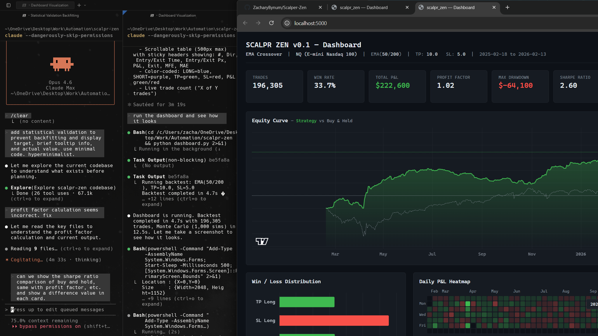

# scalpr_zen

Hyperminimalist backtesting environment for scalping strategies on CME Globex futures. Every parameter visible, every result visible, no black boxes.



## Features

- **Tick-level backtesting** on 93M+ NQ futures ticks (1 year of Databento trade data)
- **Numba JIT-compiled** TP/SL simulation with parallel execution — full backtest in ~4s on 8-core CPU
- **Interactive dashboard** with equity curve, win/loss distribution, daily P&L heatmap, hourly and day-of-week breakdowns
- **Statistical validation** — expectancy, t-statistic, p-value, SQN, and % days profitable
- **Monte Carlo analysis** — 1,000 permutation simulations with confidence bands and drawdown percentiles
- **Contract rollover handling** — automatically detects quarterly roll boundaries and invalidates trades that span them
- **Buy & hold comparison** — per-segment B&H equity curve, Sharpe ratio, and max drawdown alongside strategy metrics
- **Plain text reports** — every backtest writes a complete `.txt` file with full parameter set and trade log

## Architecture

The core simulation is pure Python + NumPy + Numba. No pandas, no backtrader, no heavy frameworks.

```
scalpr_zen/
├── data.py          # Databento DBN → .npz preprocessing with rollover detection
├── engine.py        # Backtest engine: EMA signals → fill simulation → summary stats
├── gpu.py           # Numba @njit parallel TP/SL scanner
├── strategy.py      # Strategy config (EMA crossover)
├── monte_carlo.py   # Permutation-based Monte Carlo with percentile curves
├── report.py        # Plain text report writer
├── web.py           # Flask dashboard backend
├── types.py         # Typed dataclasses (Fill, BacktestResult, BacktestSummary)
└── templates/
    └── index.html   # Dashboard frontend (Chart.js)
```

## Quick Start

```bash
# Install dependencies
pip install databento numpy numba flask

# Preprocess raw DBN files to cache (one-time, ~2.5 min)
python preprocess.py

# Run backtest and write report to results/
python run_backtest.py

# Launch interactive dashboard at http://localhost:5001
python dashboard.py
```

## Configuration

All parameters are set at the top of `dashboard.py` or `run_backtest.py`:

| Parameter | Default | Description |
|-----------|---------|-------------|
| `FAST_EMA_PERIOD` | 50 | Fast EMA lookback (ticks) |
| `SLOW_EMA_PERIOD` | 200 | Slow EMA lookback (ticks) |
| `TP_POINTS` | 10.0 | Take profit distance in points |
| `SL_POINTS` | 5.0 | Stop loss distance in points |
| `POINT_VALUE` | 20.00 | NQ point value ($20/point) |
| `MONTE_CARLO_SIMS` | 1000 | Number of MC permutations |

## Data

Market data is sourced from [Databento](https://databento.com/) — GLBX.MDP3 (CME Globex) tick-level trades for NQ futures. Raw `.dbn.zst` files are preprocessed into a single `.npz` cache with front-month contract filtering and rollover boundary tracking.

## Output

Each backtest writes to `results/` as plain text:

```
═══════════════════════════════════════
 SCALPR ZEN v0.1 — Backtest Report
═══════════════════════════════════════
 Strategy:     EMA Crossover
 Run:          2026-02-16 19:24:00 UTC
───────────────────────────────────────
 Total trades:        196,305
 Win rate:            33.7% (66183W / 130122L)
 Total P&L:           +$222,600.00
 Profit factor:       1.820
 ...
```

## Tests

```bash
pytest tests/
```

## License

MIT
